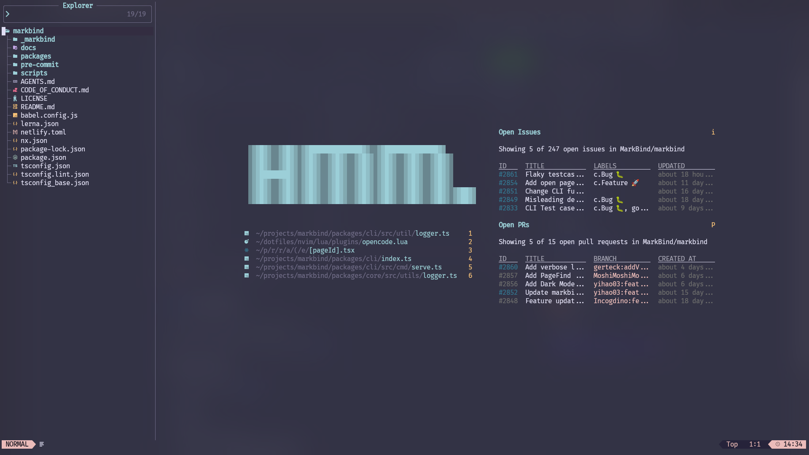

# 💤 LazyVim

probably spent way too much time on this.

currently used with wezTerm. See wezterm config
[here](https://github.com/yihao03/wezterm)

## Dependencies

- nyancat (see my fork [here](https://github.com/yihao03/nyancat))
- cmatrix
- gh cli
- glab cli
- tectonic (for vimtex)
- latex2text (for `render-markdown.nvim`)
- win32yank.exe (for clipboard support in WSL)
  - xsel/xclip is also supported

## Screenshots

### In repos with PRs/issues

### In repos without PRs/issues

